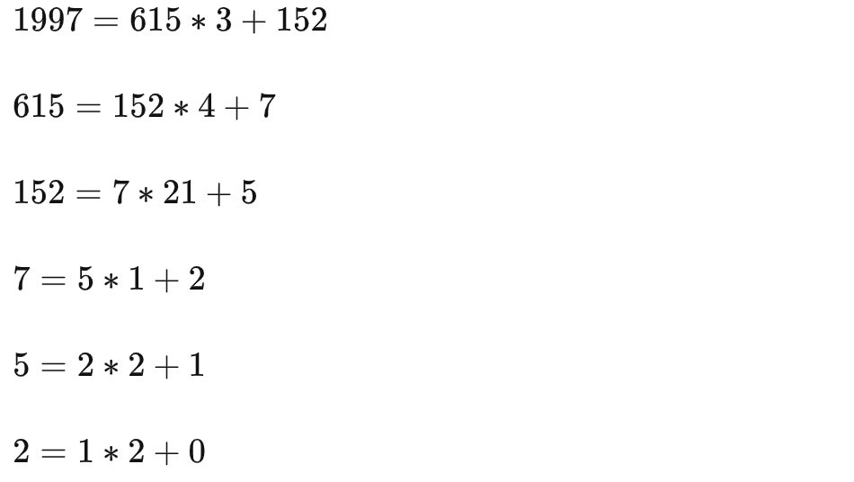
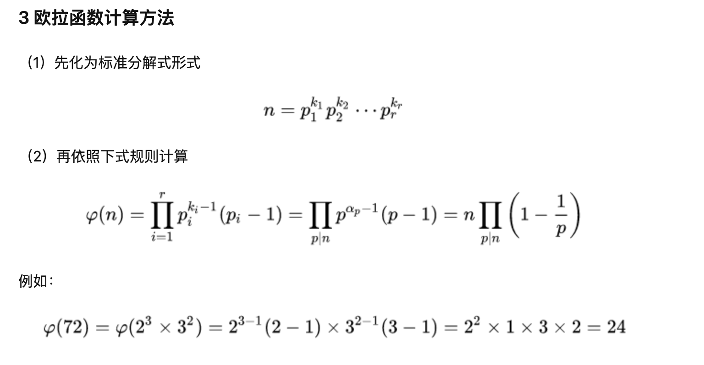

# 环:

##

1.集合 Zm= {0,1,2,...,m-1}

- 存在两种操作+和\*,使得所有的 a,b ∈ Zm,有:(≡ 同余)  
   a + b ≡ c mod m (c ∈ Zm)  
   a \* b ≡ d mod m (d ∈ Zm)

* 如果环内两个数相加或者相乘结果都在环内，那么这个环是封闭的
* 加法和乘法是可结合的,例如  
  a,b,c ∈ Zm,(a+b)+c = a +(b +c),(a\*b) _c = a _(b\*c)
* 加法中存在中性元素 0,使得每个元素 a ∈ Zm,都有 a + 0 ≡ a mod m
* 环内的如何元素 a 都存在一个负元素 -a,使得 a+(-a)≡ 0 mod m,即加法逆元始终存在
* 乘法中存在中性元素 1,对每个 a ∈ Zm,都有 a\*1 ≡ a mod m
* 不是所有元素都存在乘法逆元,假设 a ∈ Zm,乘法逆元可以定义为 a^-1  
  a·a^-1 ≡ 1 mod m
* 如果元素 a 的乘法逆元存在,则可以除以这个元素,因为 b/a ≡ b·a^-1 mod m
  找到一个元素的逆元比较困难(通常使用欧几里得算法)，可以用一种简单方法判断一个给定元素 a 的逆元是否存在,  
  当且仅当 gcd(a,m) = 1,一个元素 a ∈ Zm 存在乘法逆元 a^-1,其中 gcd 表示最大公约数，即同时能除 a 和 m 的最大整数,如果 gcd(a,m)=1,  
  则 a 和 m 就被称为互为素数或互质。  
  例如判断 Z26 中 15 的乘法逆元是否存在  
  Z26 = {0,1,2,3...24,25}  
  gcd(15,26) =1,表示 15 存在逆元  
  gcd(14,26) =2 != 1 ,表示 14 的乘法逆元不存在
* 对于所有的 a,b,c ∈ Zm,都有 a *(b+c) = (a *b) + (a \*c ),即满足分配律

# 仿射密码

- 假设 x,y,a,b ∈ Zm,m=26
- 加密: Ek(x) = y ≡ a \* x + b mod 26

* 解密 Dk(y) = x ≡ a^-1( y -b) mod 26  
  其中 k=(a,b),且满足条件 gcd(a,26)= 1
* 推导:
  a\*x +b ≡ y mod 26  
  a \*x ≡ (y-b) mod 26  
  x = a^-1 ·(y-b) mod 26  
  从 Zm,m=26 中找到 a,且元素 a 与 m 互素，则 a ∈ {1,3,5,7,9,11,15,17,19,21,23,25}  
  接下来我们找 a^-1  
  如果 a = 3,则 a^-1= 9 ,因为 a·a^-1 = 3 \*9 mod 26 = 1,且 gcd(a^-1,26) = 1  
  假设密钥 k =(a,b) = (9,13):  
  假设 x1=19  
  y = a*x1 +b mod 26 = (9 * 19+ 13 ) mod 26 = 9 \* 19 + 13 mod 26 = 2

* 反推:  
  y= 2  
  x= a^-1·(y-b) mod 26 = a^-1·(2 -13) mod 26 = 3\*15 mod 26 =19  
  a 可以取值数量为 12，b 可以取值范围为 26，密钥空间 12 \* 26 = 312

# 非对称加密

## 单向函数

- 函数 f(x) 是一个单向函数，仅当:
  y=f(x) 在计算上是容易的，且 x=f^-1(y) 在计算上是非常困难的
  实际公钥方案中使用两种主流的单向函数，一个是整数分解，给定两个大素数，
  计算他们的乘积非常容易，但是因式分解非常困难，代表(RSA)。  
  另一个是离散对数

## 欧几里得算法

- 定理:  
  两个整数的最大公约数等于其中较小的那个数和两数相除余数的最大公约数  
  用数学表示 gcd(a,b) = gcd(b, a mod b)

1997 和 615 为例，用欧几里得算法求解如下：

当被加的数为 0 时，可以得出，1997 和 615 的最大公约数为 1。

扩展欧几里得算法:  
扩展欧几里得算法不仅可以计算 gcd, 还可以计算 gcd 的线性方程:  
gcd(a,b) = a*x+b*y
其中 a,b 均为整形,
我们令 a*x+b*y= gcd(a,b)  
a/b=[a/b]...r,r 为余数则,r=a - [a/b]\*b  
因为,gcd(a,b)= gcd(b, a%b) = gcd(b,r)  
根据裴蜀定理:  
当 b=0 时,x=1,y=0
当 b!=0 时
=> b*x1+r*y1= d  
=> b*x1+(a-[a/b]*b)y1= d  
=> b*x1+a*y1-[a/b]*b*y1=d  
=> a\*y1 + b(x1-[a/b]y1)=d  
因为 a*x+b*y=d  
所以 x =y1,y= (x1-[a/b]\*y1)

## 欧拉函数

- 在 Zm={0,1,...m-1}中,我们如何求有多少个数与 m 互质  
  假设 m=6,Zm={0,1,2,3,4,5}  
  gcd(0,6) = 6  
  gcd(1,6) = 1  
  gcd(2,6) = 2  
  gcd(3,6) = 3  
  gcd(4,6) = 4  
  gcd(5,6) = 1
  这个示例中有 1,和 5 ,所有欧拉函数值为 2 ,φ(6)=2
  如果 m 非常大，那么求这个整数对应的欧拉函数是非常困难的，如果 m 的因式分解是以知的，则存在一个简单的计算方法  
  
  在用这种方法快速计算欧拉函数时，我们必须知道 m 的因式分解，这也是 RSA 核心

## 费马小定理
